# 2026 관광데이터 활용 공모전 웹·앱 구현 부문 기능설명서 초안

이 문서는 제공된 9페이지 기능설명서 양식에 옮겨 적기 위한 문안 초안이다. 최종 PPT에서는 양식의 빨간색 가이드 문구를 모두 삭제하고, 실제 서비스 화면을 캡처해 넣는다. 팀명과 최종 서비스명은 참가 신청서의 등록 정보와 일치시킨다.

## 1페이지 | 표지

- 팀 명: `navydev`
- 서비스 명: `PawProof: 반려견 동반여행 코스 사전검증`

서비스명을 참가 신청서에 `PawProof`로만 등록했다면 표지와 모든 페이지에서 동일하게 `PawProof`를 사용한다. 서비스명을 변경할 수 있는 경우에만 설명형 부제를 붙인다.

## 2페이지 | 서비스 소개

### 서비스명

PawProof: 반려견 동반여행 코스 사전검증

### 서비스 유형

설치 가능한 웹 서비스(PWA)

### 서비스 타깃

반려견과 함께 당일 여행을 준비하며 방문지별 출입 조건과 준비사항을 미리 확인하고 싶은 보호자

### 서비스 개요

반려견의 체중·마릿수·이용 구역과 방문지별 동반 규정을 대조해, 출발 전 확인사항과 대체 코스를 함께 제안하는 반려견 여행 코스 검증 서비스다. 모바일과 데스크탑에서 앱처럼 설치할 수 있어 여행 중에도 지도·여행 노트·검사 결과를 한 화면 흐름으로 다시 열 수 있다.

### 선택 지정과제

과제번호 6번

### 지정과제

모호한 반려동물 출입 조건 및 규정 인지 오류로 현장 입장 거부 및 헛걸음 유발 문제

### 지정과제 선택 이유

반려견 동반 여행 정보는 장소 목록만으로는 충분하지 않다. 실내·야외 구역, 체중·마릿수, 이동장·입마개·예약 여부처럼 장소별 조건이 다르고, 정보가 없거나 모호한 경우 현장에서 입장이 거부될 수 있다. PawProof는 한국관광공사 관광데이터를 출발점으로 장소 규정을 확인하고, 불확실한 조건은 숨기지 않으면서 사용자가 실제로 준비하거나 문의할 수 있는 형태로 바꾼다.

## 3페이지 | 지정과제 기반 서비스 기획 방향

### 지정과제 기반 서비스 기획 방향

PawProof는 장소를 단순히 추천하는 대신 사용자가 계획한 코스를 먼저 입력받고, 반려견별 조건과 방문 시간·이용 구역을 장소 규정과 대조한다. 판정은 `이용 가능·준비 필요·확인 필요·이용 불가`로 나누며, 입장 자체가 확인된 장소에는 `반려견 출입 가능`을 별도로 표시한다. 체중·마릿수·구역·예약처럼 아직 확인해야 할 조건은 문의 문구와 함께 보여준다.

문제가 있는 방문지는 코스 전체를 버리게 하지 않고 같은 목적의 대체 장소를 탐색한다. 대체 장소를 적용한 뒤에는 이후 방문지의 도착 시각과 이동시간까지 다시 계산한다. 사용자는 지도에서 장소를 고르고, 여행 노트에서 근거·준비사항·구간별 이동시간을 확인한 뒤 출발 전 코스를 확정할 수 있다.

PWA를 선택한 이유는 여행자가 앱스토어 설치나 별도 계정 없이도 바로 시작하고, 자주 쓰는 기기에서는 홈 화면 아이콘으로 다시 열 수 있게 하기 위해서다. 설치 후에도 장소 검색·규정 조회·코스 검사는 최신 공식 자료를 사용하므로 인터넷 연결이 필요하며, 오프라인에서는 입력을 임의로 판정하지 않고 상태를 안내한다.

### LLM을 이용한 문제 해결

PawProof는 관광데이터의 비정형 안내문을 그대로 나열하는 데서 끝나지 않는다. 사용자가 장소를 선택하면 OpenRouter 기반 LLM이 KTO 원문에서 반려견 출입 구역, 견종·체중·마릿수 조건, 준비물, 운영시간, 예방접종 안내와 모호한 예외를 구조화한다. 이 구조화 결과를 사용자의 반려견·방문 시간·이용 구역과 연결해, 흩어진 규정을 `여기까지 확인했어요`, `방문 전 확인할 부분`, 준비사항으로 바꾼다.

확인할 내용은 업체에 바로 보낼 수 있는 자연스러운 문의 문장으로도 정리한다. 장소명·방문일·실내외 구분·반려견 정보를 포함하고, 확인되지 않은 항목은 질문으로 남겨 사용자가 실제로 다음 행동을 할 수 있게 한다. 코스 검사와 대체 장소 비교에서도 같은 규정 구조화를 재사용한다.

LLM이 출입 가능 여부를 추측하지 않도록 원문 근거를 함께 요구하고, 구조화 응답의 형식·근거·수치를 서버에서 검증한다. 최종 `이용 가능·준비 필요·확인 필요·이용 불가` 판정은 결정론적 규칙 엔진이 수행한다. LLM 호출이 실패하거나 자료가 부족하면 이용 가능으로 바꾸지 않고 `확인 필요`와 기본 문의 문구를 제공한다.

### 문제 해결의 핵심

1. **후보와 확인된 장소를 분리한다.** KTO·식품안전나라 데이터는 장소 후보로 보여주고, 사용자가 장소를 선택한 시점에 상세 규정을 조회한다.
2. **출입 가능과 세부 조건을 나눠 보여준다.** 반려견 출입이 확인된 장소라도 체중·마릿수·실내외 구역·예방접종·예약 정보가 없으면 `확인 필요`를 함께 표시한다.
3. **LLM으로 비정형 규정을 행동 가능한 정보로 바꾼다.** OpenRouter가 원문에서 조건·예외·근거를 구조화하고 업체 문의 문장까지 정리한다. 최종 상태는 검증된 규정과 결정론적 규칙으로 계산한다.
4. **문제가 생긴 코스를 복구한다.** `이용 불가` 방문지에 대해서만 같은 목적의 `이용 가능·준비 필요·확인 필요` 후보를 비교하고, 교체 후 전체 일정을 다시 검사한다.

### 해시태그 목록

`#반려견맞춤형` `#규정검증` `#코스복구` `#관광데이터활용` `#PWA접근성`

## 4페이지 | 해시태그 연계 핵심 기능 및 상세 내용

양식의 해시태그별 슬라이드는 아래 5개를 각각 작성한다. 공간이 부족하면 해시태그당 1장씩 복사해 사용한다.

### #반려견맞춤형

**연계 핵심 기능**

- 반려견별 이름·견종·체중 입력
- 여러 반려견의 조건 동시 반영
- 이동장·유모차·입마개·예약 등 준비 상태 반영
- 실내·실외 이용 구역별 조건 비교

**상세 내용**

사용자가 함께 가는 반려견을 직접 입력하거나 등록 프로필에서 선택하면 각 반려견의 체중과 동반 조건을 코스 검사에 반영한다. 반려견이 여러 마리인 경우 체중 조건과 마릿수 제한을 함께 평가하며, 장소의 실내·실외 이용 구역에 따라 다른 규정을 적용한다.

### #규정검증

**연계 핵심 기능**

- 장소 선택 시 공식 동반 규정 조회
- 원문 근거·출처·조회 시각 표시
- 이용 가능·준비 필요·확인 필요·이용 불가 판정
- 입장 가능 여부와 추가 확인사항 분리 표시

**상세 내용**

한국관광공사 반려동물 동반여행 API의 장소·상세·동반 정보를 조회하고, 필요한 경우 식품안전나라 공식 음식점 목록을 함께 확인한다. 규정 원문에서 입장 가능, 체중, 마릿수, 구역, 장비, 예방접종, 운영시간 정보를 추출한 뒤 결정론적 규칙으로 판정한다. 정보가 없거나 충돌하면 이용 가능으로 추정하지 않고 `확인 필요`로 남긴다.

### #코스복구

**연계 핵심 기능**

- 문제 방문지의 대체 후보 탐색
- 방문 목적과 반려견 조건을 고려한 대체
- 대체 적용 후 전체 일정 재검증
- 차량·도보 구간별 이동시간 표시

**상세 내용**

조건이 맞지 않는 방문지가 생겨도 사용자가 만든 코스 전체를 다시 작성하지 않도록 한다. 같은 카테고리의 후보를 탐색하고, 반려견 조건·이용 구역·방문시간을 다시 비교한다. 대체 장소를 적용하면 이후 방문지의 도착 시각, 차량 이동시간, 도보 이동시간을 함께 갱신한다.

### #관광데이터활용

**연계 핵심 기능**

- 한국관광공사 OpenAPI 기반 장소 검색
- 서울 명동 중심의 지도 탐색
- 관광지·식당·카페 장소 후보 통합
- 공식 음식점 파일데이터와 장소 후보 병합

**상세 내용**

한국관광공사 반려동물 동반여행 OpenAPI를 사용해 장소 후보와 상세 동반 정보를 실시간으로 조회한다. 지도에서 사용자가 선택한 장소만 상세 규정을 추가로 확인해 불필요한 호출을 줄인다. 식품안전나라 공식 반려동물 동반출입 음식점 목록은 보조 장소 후보와 공식 등재 근거로 사용하되, 세부 조건이 없는 경우에는 확인 필요 상태를 유지한다.

### #PWA접근성

**연계 핵심 기능**

- 모바일·데스크탑 홈 화면 설치와 standalone 실행
- 지도·여행 노트·검사 결과를 기기에서 이어서 확인하는 흐름
- 회원가입 없이 핵심 코스를 시작하는 낮은 진입 장벽
- 온라인 규정 조회와 오프라인 한계의 명확한 안내

**상세 내용**

PawProof는 네이티브 앱을 별도로 설치하지 않아도 브라우저에서 시작할 수 있고, 지원 브라우저에서는 홈 화면에 설치해 앱처럼 다시 열 수 있다. 작은 화면에서는 지도를 중심으로 장소를 고르고, 데스크탑에서는 지도와 여행 노트를 함께 보며 코스를 편집한다. 실제 규정 조회는 최신 API 연결이 필요하므로 오프라인에서 확인되지 않은 내용을 이용 가능으로 바꾸지 않는다. 이 선택은 여행 중 즉시 재진입하고, 장소를 고른 기기에서 코스 맥락을 유지하려는 온디바이스 편의성을 위한 것이다.

## 5페이지 | 기능 흐름도 및 서비스 화면

### 해시태그별 기능 흐름도

기능 흐름은 하나의 긴 순서도로 합치지 않고, 심사자가 해시태그별 입력·처리·결과를 바로 확인할 수 있도록 별도 이미지로 제시한다. 아래 SVG는 최종 PPT 또는 PDF에 그대로 배치할 수 있는 벡터 이미지다.

아래 실제 제품 캡처는 `https://www.pawproof.kr`에서 2026-09-18에 비회원 예시 입력으로 촬영했다. 양식의 `기능 흐름도` 큰 이미지 영역에는 흐름도와 함께 해당 캡처를 배치하면 기능 설명과 실제 동작을 한 번에 보여줄 수 있다.

#### #반려견맞춤형

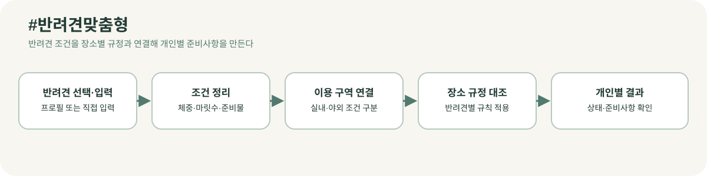

실제 제품 화면: 반려견 이름·견종·체중과 준비물을 입력하는 화면

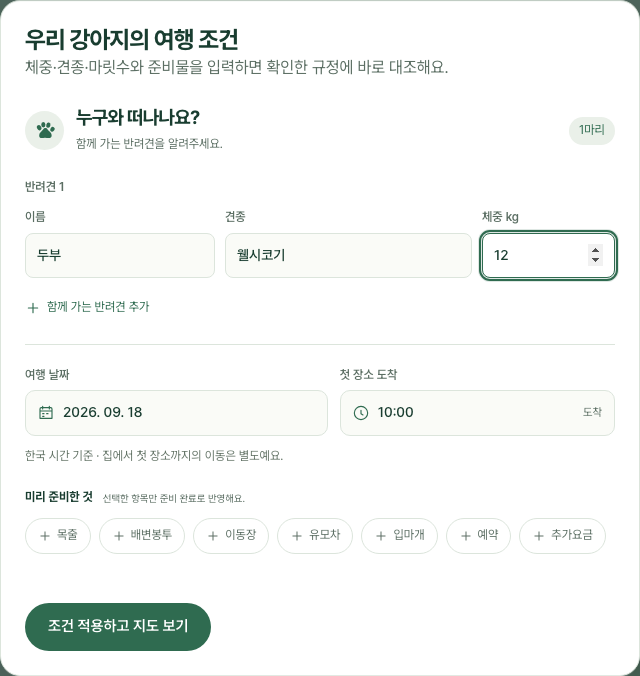

반려견 프로필 또는 직접 입력한 조건을 이용 구역과 장소 규정에 대조해 반려견별 결과와 준비사항을 만든다.

#### #규정검증

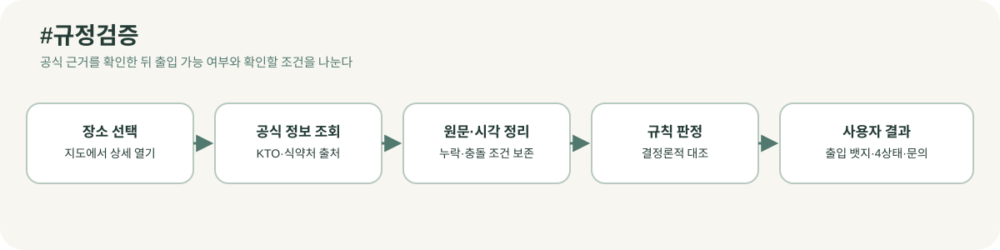

실제 제품 화면: 장소 선택 후 공식 조회 시각, `반려견 출입 가능`, `확인 필요`, 확인된 규정이 함께 표시되는 화면

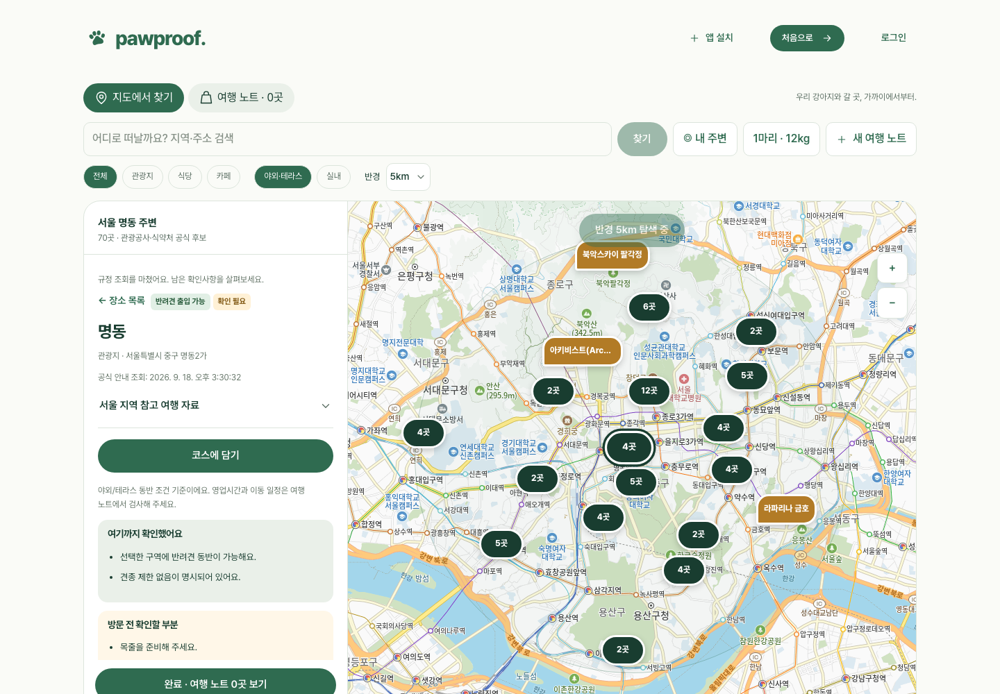

장소를 선택한 시점에 공식 출처를 조회하고, 원문·조회 시각을 보존한 뒤 출입 가능 뱃지와 네 가지 상태로 정리한다.

#### #코스복구

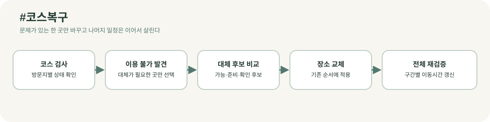

실제 제품 화면: 여행 노트에서 코스 검사 후 지도·차량·도보 이동시간과 구간별 검토를 확인하는 화면

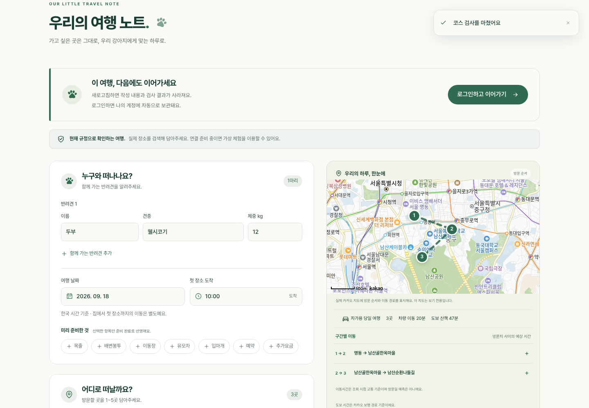

이용 불가 방문지만 대체 후보로 교체하고, 교체 후 전체 코스의 순서·구간별 이동시간·판정을 다시 계산한다.

#### #관광데이터활용

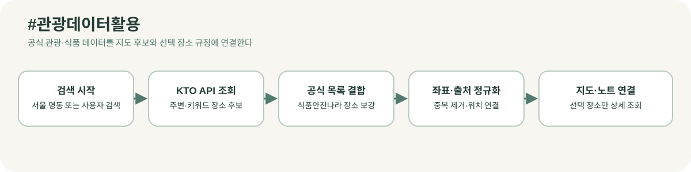

실제 제품 화면: 서울 명동 중심으로 KTO·식약처 공식 후보를 지도와 목록에서 탐색하는 화면


서울 명동 또는 사용자가 검색한 위치에서 KTO 후보를 찾고, 식품안전나라 공식 목록을 보강한 뒤 선택 장소만 노트에 담는다.

#### #PWA접근성

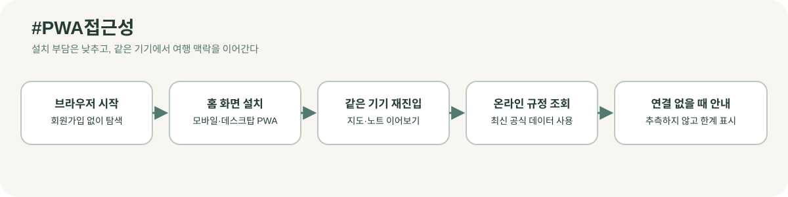

실제 제품 화면: 별도 앱 설치 없이 브라우저에서 시작하고 `앱 설치`로 홈 화면 재진입을 안내하는 시작 화면

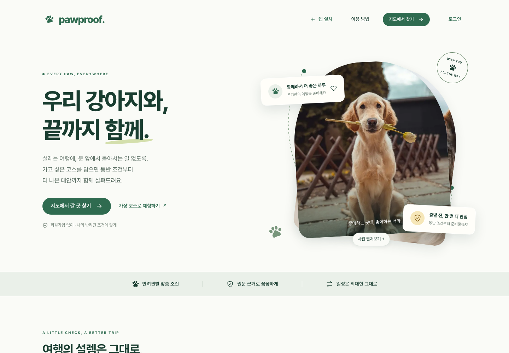

브라우저에서 바로 시작해 홈 화면에 설치하고, 같은 기기에서 지도·노트를 이어 보되 연결이 없을 때는 규정을 추측하지 않고 한계를 안내한다.

### 구현에서 데이터와 AI가 연결되는 지점

```text
KTO·식품안전나라 원천 데이터
  ↓ 장소 후보·공식 출처·기준일 정규화
장소 선택 시 KTO 상세·동반 정보 조회
  ↓ 원문 근거와 누락 조건 추출
OpenRouter 보조 정리
  ↓ 업체에 보낼 자연스러운 문의 문장 생성
결정론적 규칙 엔진
  ↓ 반려견·구역·시간·준비물 대조
방문지별 상태 + 출입 가능 뱃지 + 확인 시점
```

이 구조의 핵심은 AI가 장소 출입을 임의로 확정하지 않는다는 점이다. 데이터가 충분하면 사용자가 바로 이해할 수 있는 상태를 제공하고, 데이터가 부족하면 무엇을 확인해야 하는지와 실제 문의 문장을 남겨 현장 입장 거부 가능성을 줄인다.

### 화면 캡처 옆 설명

- 서비스 메인화면에서 `지도에서 갈 곳 찾기`를 선택한다.
- 서울 명동을 기본 위치로 두고 지역·주소를 검색하거나 지도를 움직여 주변 장소를 찾는다.
- 장소를 선택하면 해당 장소의 공식 동반 규정과 조회 상태를 확인한다.
- `코스에 담기`를 눌러 방문 순서와 이용 구역·체류시간을 정한다.
- 여행 노트에서 반려견 조건과 코스를 검사한다.
- 문제 조건이 있으면 대체 장소, 준비사항, 문의 문구를 확인한다.
- 실제 장소 모드에서는 카카오 지도에 방문 순서와 경로를 표시한다.
- 모바일·데스크탑에서는 `앱 설치` 안내로 홈 화면에 추가해 같은 여행 노트를 다시 열 수 있다.

### 해시태그 연계 기능 입력 예시

- 해시태그1: `#반려견맞춤형`
- 연계기능1: 반려견별 조건 입력 및 코스 판정
- 기능설명1: 함께 가는 반려견의 체중·마릿수·준비 상태를 장소별 규정과 대조해 개인별 결과를 보여주는 기능입니다.

- 해시태그2: `#규정검증`
- 연계기능2: 장소별 공식 규정 조회와 근거 표시
- 기능설명2: 장소를 선택한 시점에 공식 안내를 조회하고, 출입 가능 여부와 추가 확인사항을 원문·출처·조회 시각과 함께 보여주는 기능입니다.

- 해시태그3: `#코스복구`
- 연계기능3: 대체 장소 적용 및 전체 코스 재검증
- 기능설명3: 조건이 맞지 않는 방문지를 같은 목적의 후보로 바꾼 뒤 이후 방문지의 도착 시각과 이동시간까지 다시 계산하는 기능입니다.

- 해시태그4: `#관광데이터활용`
- 연계기능4: 한국관광공사 OpenAPI 기반 장소 탐색
- 기능설명4: 한국관광공사 반려동물 동반여행 API에서 장소 후보와 동반 정보를 조회해 지도와 여행 노트에 연결하는 기능입니다.

- 해시태그5: `#PWA접근성`
- 연계기능5: 모바일·데스크탑 설치형 웹앱과 여행 노트 재진입
- 기능설명5: 앱스토어 설치 없이 브라우저에서 시작하고, 지원 기기에서는 홈 화면에 설치해 지도와 여행 노트를 앱처럼 다시 여는 기능입니다.

## 6페이지 | 서비스 이미지

### 대표 이미지 1장

서울 명동 지도를 배경으로 장소 후보와 겹친 장소 수가 보이는 화면을 대표 이미지로 사용한다. 실제 배포 화면 캡처:

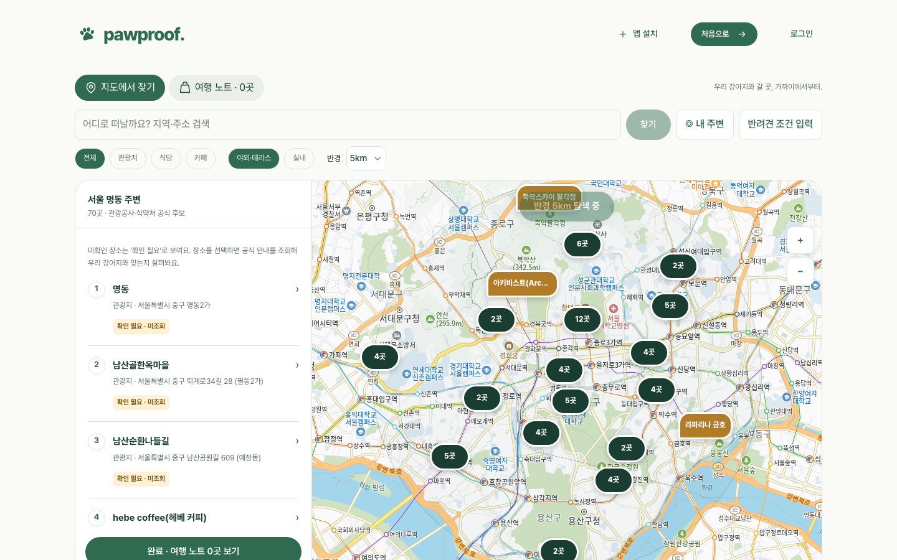

캡처 기준: `https://pawproof.kr/plan`, 2026-09-18. 지도 데이터와 장소 수는 조회 시점에 따라 달라질 수 있다.

### 상세 이미지 3~5장

다음 화면을 상세 이미지로 넣는다.

1. 서비스 진입과 PWA 설치 가능성을 보여주는 홈 화면

   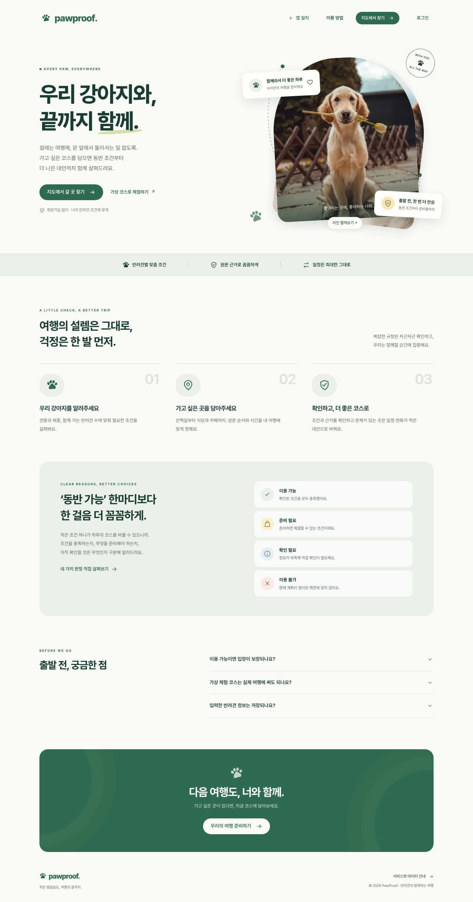

2. 서울 명동에서 장소를 검색하는 데스크탑 지도 화면

   

3. 모바일에서 지도를 중심으로 장소를 탐색하는 화면

   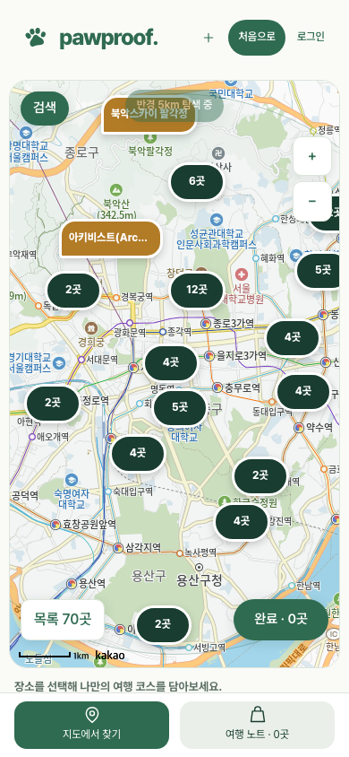

4. 반려견 조건과 방문 순서를 관리하는 가상 여행 노트 화면

   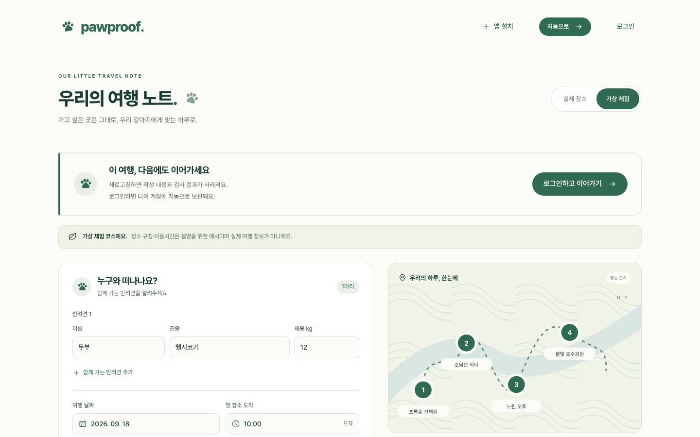

5. 장소 상세 화면의 `반려견 출입 가능`·`확인 필요` 뱃지와 공식 조회 시각

   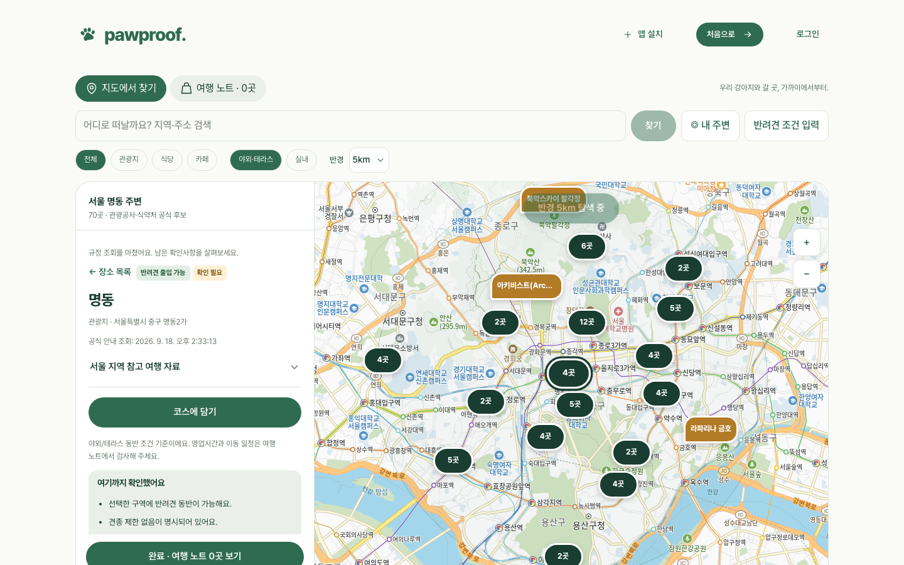

   장소를 선택한 뒤 공식 규정 조회가 완료된 실제 화면이다. 문의 문구는 상세 화면의 접힘 영역을 열어 추가 캡처할 수 있다.

화면 캡처에는 실제 테스트 장소와 실제 결과를 사용한다. 가상 체험 화면은 이미지와 설명에 `가상 체험`임을 표시한다. 위 파일은 `pawproof.kr` 배포 화면을 2026-09-18에 캡처한 제출용 보조 이미지다.

## 7페이지 | 한국관광공사 OpenAPI

### API 1

- API명: 한국관광공사 반려동물 동반여행정보 서비스 (`KorPetTourService2`)
- 상세설명: 반려견 동반 여행 장소의 검색·주변 탐색·지역 기반 목록과 장소 상세 정보를 조회하는 핵심 데이터로 활용한다. `searchKeyword2`, `locationBasedList2`, `areaBasedList2`로 관광지·식당·카페 후보를 찾고, `detailCommon2`, `detailIntro2`, `detailPetTour2`로 장소 설명·운영 정보·동반 가능 구역과 준비사항을 확인해 코스 검사에 사용한다.
- 화면 출처 표기: `출처: ⓒ한국관광공사`

양식의 2~5번 행은 실제로 별도 API로 신청·사용한 것이 없다면 삭제하거나 비워 둔다. 하나의 KTO 서비스 안의 엔드포인트를 서로 다른 API처럼 부풀려 적지 않는다.

## 8페이지 | 기타 API·파일데이터

선택 항목이므로 실제 서비스에 최종 사용된 자료만 남긴다.

### 데이터 1

- 데이터명: Kakao Maps SDK·Kakao Local API·Kakao Mobility 길찾기 API
- 상세설명: 지도 표시와 주소·장소 검색에 Kakao Maps SDK와 Local API를 사용하고, 코스 검사 후 방문지 사이의 자동차·도보 이동시간 계산에 Kakao Mobility 경로 API를 사용한다.

### 데이터 2

- 데이터명: 식품안전나라 반려동물 동반출입 음식점 목록
- 상세설명: 2026년 3월 31일 기준 공식 음식점 목록을 장소 후보와 병합하고, 해당 목록 등재에 따른 `반려견 출입 가능` 근거를 표시한다. 실내·테라스·체중·마릿수·예약 등 목록에 없는 세부 조건은 확인 필요로 남긴다.

### 데이터 3

- 데이터명: OpenRouter API
- 상세설명: KTO 장소 원문의 비정형 동반 규정을 조건·예외·근거가 있는 구조화 규정으로 바꾸고, 장소별 남은 확인 항목을 사용자가 실제로 업체에 문의할 수 있는 자연스러운 문장으로 정리하는 데 사용한다. 응답은 형식·근거·수치를 서버에서 검증하며 최종 이용 가능 여부는 LLM이 아니라 규정 데이터와 결정론적 판정 규칙으로 결정한다.

Firebase, Umami 등 계정 저장·분석·운영 인프라는 관광 데이터 출처가 아니므로 이 페이지에는 넣지 않는다.

## 9페이지 | 차별성 및 발전계획

### 차별성

기존 관광 장소 검색 서비스가 장소 목록과 기본 정보를 제공하는 데 그친다면, PawProof는 사용자가 실제로 계획한 코스를 반려견 조건과 방문시간까지 포함해 사전 검증한다. 장소에 반려견 출입 가능 정보가 있더라도 실내·야외 구역, 체중·마릿수, 장비·예약 여부가 확인되지 않으면 그 차이를 분리해 보여준다.

또한 `확인 필요`를 단순 경고로 끝내지 않는다. 원문 근거와 확인 시각을 보여주고, 사용자가 바로 물어볼 수 있는 문의 문구와 준비사항을 제공한다. 이용이 어려운 장소는 같은 목적의 대체 장소를 제안하고, 대체 후 전체 코스를 다시 계산해 기존 여행 계획의 변경을 최소화한다.

PWA는 이 문제 해결을 여행자의 기기 맥락 안으로 가져온다. 모바일에서는 지도와 장소 선택을 크게 사용하고, 데스크탑에서는 코스와 근거를 넓게 비교하며, 설치 후에는 앱스토어를 거치지 않고 여행 노트로 재진입할 수 있다. 인터넷이 끊겼을 때 규정을 추측하지 않고 오프라인 한계를 안내하는 것도 신뢰를 지키기 위한 설계다.

### 데이터·LLM 활용의 핵심 기여

| 해결 단계 | 데이터·기술의 역할 | 사용자가 얻는 결과 |
| --- | --- | --- |
| 장소 후보 확장 | KTO OpenAPI와 식품안전나라 공식 목록을 병합 | 지도에서 실제 후보를 폭넓게 탐색 |
| 장소별 사실 확인 | 장소 선택 시 KTO 상세·동반 정보를 조회하고 출처·시각 표시 | 후보와 확인된 근거를 구분 |
| 규정 의미 구조화 | OpenRouter가 원문에서 조건·예외·근거를 추출하고 서버가 응답을 검증 | 흩어진 안내를 반려견·구역별 확인 항목으로 이해 |
| 문의 문장 생성 | OpenRouter가 장소·방문일·반려견 정보와 남은 확인사항을 자연스러운 질문으로 변환 | 업체에 바로 보낼 수 있는 문의 문구 |
| 안전한 판정 | 결정론적 규칙이 체중·마릿수·구역·시간·장비를 대조 | AI 추측이 아닌 네 가지 상태 |
| 코스 복구 | 이용 불가 장소만 대체하고 세 상태 후보를 비교한 뒤 재검증 | 기존 하루 계획을 최대한 유지 |

### 발전계획

1. 서울 명동에서 시작해 KTO 데이터가 충분한 지역과 식품안전나라 공식 목록을 단계적으로 확장한다.
2. 장소별 공식 안내의 확인 시각·변경 이력을 관리해 오래된 규정을 구분한다.
3. 업체의 실내·야외 구역, 체중·마릿수, 예방접종·예약 조건을 더 구조화해 확인 필요 범위를 줄인다.
4. 실제 보호자 사용성 평가를 통해 코스 검사 시간, 남은 확인 항목, 대체 장소 선택률을 측정한다.
5. 보호자가 확인한 최신 업체 안내를 출처와 확인일 기준으로 검수한 뒤 장소 데이터 품질 개선에 반영한다.
6. 지역별 관광 동선과 반려견 조건을 결합해 당일 여행뿐 아니라 숙박·장거리 코스로 확장한다.
7. 설치 재진입·기기별 사용성·오프라인 한계를 실제 보호자 평가로 검증해 PWA 경험을 개선한다.

## 제출 직전 확인 목록

- [ ] 팀명·팀원·서비스명이 참가 신청 정보와 일치한다.
- [ ] 지정과제는 6번 하나만 기재했다.
- [ ] 양식의 모든 빨간 가이드 문구와 예시 문구를 삭제했다.
- [ ] 실제 서비스 화면 대표 이미지 1장과 상세 이미지 3~5장을 넣었다.
- [ ] 해시태그별 기능 흐름도에 대응하는 실제 제품 캡처 5장을 넣었다.
- [ ] 캡처 파일은 `pawproof.kr` 배포 화면 기준이며 캡처 날짜와 URL을 표기했다.
- [ ] 해시태그별 기능 흐름도 5장과 각 해시태그의 기능 설명이 실제 구현과 일치한다.
- [ ] KTO OpenAPI 목록은 실제 사용한 서비스만 작성했다.
- [ ] KTO 인증키·비밀번호·개인 계정을 이미지나 PDF에 넣지 않았다.
- [ ] 기타 API·파일데이터는 실제 최종 서비스에 사용한 자료만 작성했다.
- [ ] PDF로 변환한 뒤 글자 잘림, 이미지 해상도, 표 밖으로 나간 문장이 없는지 확인했다.
