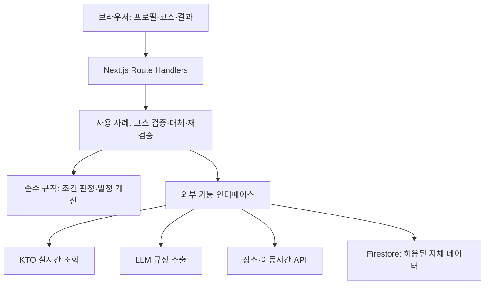

# 애플리케이션 아키텍처

기준일: 2026-09-10\
상태: 설계안. 아래 파일·인터페이스는 구현 목표이며 현재 존재하는 코드가 아니다.

## 구조 원칙

하나의 Next.js 앱 안에서 화면, 사용 사례, 판정 규칙, 외부 서비스 연결을 분리한다. 현재 사용자 혼자 개발하는 제출 버전에 마이크로서비스·별도 API 서버·범용 의존성 주입 프레임워크를 추가하지 않는다. 코드 의존성과 기능별 커밋 규칙은 [코드 원칙](CODE_STANDARDS.md)을 따른다.



그림은 실행 흐름이다. 코드 의존성은 외부 어댑터가 안쪽 인터페이스를 구현하는 방향으로 둔다. 도메인이 Firebase·Next.js·LLM SDK를 import하지 않는다.

## 제안 디렉터리

```text
src/
  app/                         # 라우트·레이아웃·얇은 HTTP 진입점
  features/
    pet-profile/               # 프로필 화면과 입력 상태
    itinerary/                 # 코스 편집 화면
    verification/              # 판정·근거 화면
    recovery/                  # 대체 비교·준비표 화면
  domain/
    pets/                      # 반려견 조건
    policies/                  # 규정·증거·판정 함수
    itinerary/                 # 방문 시각·체류·일정 계산
  application/
    use-cases/                 # 검증, 복구 후보 조회, 적용 후 재검증
    ports/                     # PlaceSource, RuleExtractor 등
    contracts/                 # 요청·결과 DTO
  infrastructure/
    kto/                       # 요청·응답 변환과 오류 정규화
    llm/                       # 구조화 추출·스키마 검증
    kakao/                     # 장소·이동시간 연결
    persistence/firestore/     # 필요한 저장 인터페이스의 구현
  config/                      # 환경 파싱·공개 설정·서버 비밀 분리
  lib/urls/                    # basePath와 내부 URL 처리
  server/                      # 어댑터 조립·서버 전용 진입점
tests/
  unit/
  integration/
  e2e/
```

인터페이스는 교체 가능성이 있거나 테스트에서 경계를 분리해야 하는 지점에만 만든다. 단순 함수 하나마다 클래스와 인터페이스를 쌍으로 만들지 않는다. 공통 코드 폴더에는 서로 관련 없는 기능을 몰아넣지 않는다.

## 핵심 계약

| 계약 | 단일 책임 |
|---|---|
| `PlaceSource` | 장소와 현재 동반 규정·운영정보 조회 |
| `RuleExtractor` | 원문을 증거가 연결된 규정 후보로 변환 |
| `RouteTimeProvider` | 이동 구간의 예상 시간·계산 기준 제공 |
| `TripRepository` | 저장 기능을 구현하는 경우 허용된 사용자 입력 저장 |
| `UsageBudget` | 요청·토큰 예산 확인과 사용량 기록 |
| `Clock` | 현재 시각 주입. 신선도·일정 테스트 재현 |

각 공급자의 필드명은 어댑터 안에서 내부 모델로 변환한다. `contentid` 등의 원본 식별자는 공급자와 함께 보존하되 Firestore 문서 형식을 도메인 모델로 사용하지 않는다.

## 코스 검증 처리

1. 서버가 프로필·방문지 ID·날짜·체류시간을 스키마로 검증한다. 클라이언트가 보낸 판정 상태를 신뢰하지 않는다.
2. 한 요청 안에서 같은 장소 조회를 중복 제거하고, 동시 실행 수와 총 호출 수를 제한한다.
3. KTO의 현재 원문과 운영정보를 가져온다. 공사 데이터는 기본적으로 영구 캐시를 사용하지 않는 호출 경로로 연결한다.
4. LLM이 조건·적용 구역·예외·근거 구간을 추출한다. 서버가 스키마, 근거의 실제 존재, 단위와 논리 연산자를 검증한다.
5. 순수 규칙 함수가 반려견별·일행 전체 조건을 판정하고, 시간 계산이 방문 가능 구간을 확인한다.
6. 일부 장소가 실패해도 나머지 결과와 해당 장소의 확인 필요 사유를 반환한다. 무한 재시도나 성공값 대체는 하지 않는다.
7. 대체 후보는 사용자가 필요로 하는 지점부터 제한적으로 조회한다. 하드 조건을 만족한 후보만 일정 변화로 비교한다.
8. 대체 적용은 이후 일정 전체를 다시 계산하고 미확인 조건을 유지한다.

구체적인 상태 우선순위와 구역 처리는 [판정·복구 기준](../product/RULES_AND_RECOVERY.md)이 기준이다. LLM 프롬프트에 최종 정책을 숨기지 않는다.

독립적인 외부 요청은 제한된 병렬 실행으로 처리한다. 후보 전체를 무제한 `Promise.all`로 실행하지 않는다. 서버 내부에서는 사용 사례를 직접 호출하며 자기 서비스의 HTTP API를 다시 호출하지 않는다.

## 결과 모델과 재현성

결과에는 `schemaVersion`, `rulesVersion`, `verifiedAt`, 장소별 상태·사유 코드·근거·남은 확인사항을 포함한다. LLM 공급자·모델·추출 설정 버전은 운영 진단에 필요한 범위로 기록한다.

`fetchedAt`(조회), `sourceModifiedAt`(콘텐츠 수정), `policyConfirmedAt`(규정의 실제 확인)을 구분한다. 판정 응답에서 이 시점을 보여주는 것과 서버에 장기 보관하는 것은 별도 결정이다.

여행 일시는 `Asia/Seoul` 기준으로 해석하고, 서버 타임존이 UTC여도 동일한 판정이 나오게 한다. 내부 시각 저장은 오프셋이 있는 값으로 하고, ‘날짜만 있는 방문일’을 무조건 UTC 자정으로 바꾸지 않는다.

## DB와 비로그인 사용

첫 버전은 회원가입 없이 검사할 수 있게 한다. 프로필·코스 편집 상태는 브라우저 메모리를 기본으로 하고, 복원을 제공할 때 저장 항목과 지우기 동작을 정한다. 이름·연락처·GPS 수집은 핵심 검증에 필요하지 않다.

| 정보 | 초기 저장 방침 |
|---|---|
| 현재 검사 중 KTO 원문·추출 규정 | 요청 처리와 결과 표시에 필요한 범위. 서버 영구 저장·공유 캐시 기본 비활성 |
| 반려견 프로필·사용자 코스 | 브라우저 상태 우선. 서버 저장은 저장 기능 구현 시 도입 |
| 자체 작성 대표 코스의 장소 ID·순서 | 자체 기획 데이터로 저장 가능. 조회한 장소 설명·규정 복제와 구분 |
| 비용·장애 집계 | 원문·자격증명·개인 입력 없이 최소 집계 |
| 규정 확인 기록·평가용 원문 | 확보·보관 권한과 범위를 확인한 뒤 관리 |

Firestore가 준비되지 않아도 영구 저장이 필요 없는 핵심 흐름의 개발을 진행할 수 있어야 한다. Cloudflare로 바꿀 경우 실제 필요한 저장 계약만 D1으로 구현한다. Firestore Admin SDK를 Workers에서 그대로 쓸 수 있다고 가정하지 않는다.

서버 SDK는 Firestore Security Rules의 보호를 받지 않으므로 서버가 소유권·입력·허용 연산을 검사하고 IAM 권한을 제한한다. 초기 브라우저의 Firestore 직접 접근은 거부한다. 비로그인 저장을 추가하면 추측 불가능한 세션 식별자와 서버 소유권 검사를 함께 설계한다. [Firestore 서버 접근과 보안](https://firebase.google.com/docs/firestore/security/rules-conditions)

## UI와 서버의 경계

초기 문서·레이아웃은 Server Component를 기본으로 하고 지도, 코스 편집, 프로필 폼처럼 상호작용이 필요한 부분만 Client Component로 둔다. 지도 SDK는 지도를 사용할 때 로드한다. 클라이언트에 관광 API 키·DB 관리 SDK·LLM SDK를 포함하지 않는다.

React 렌더링 최적화보다 먼저 불필요한 네트워크 왕복과 클라이언트 번들을 줄인다. 사용자가 수정할 때마다 전체 코스를 즉시 재검증하지 않고 ‘검증하기’ 동작과 입력 변경 상태를 구분한다. 디자인 참고자료는 사용자가 제공하며, 지금은 화면의 정보와 행동 계약만 확정한다.
