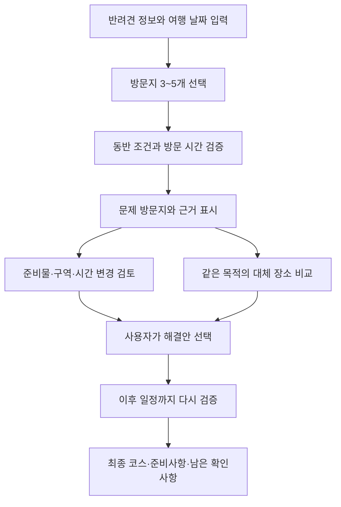

# PawProof 제품 기획

기준일: 2026-09-10\
상태: 사용자 승인 기획. 세부 기능의 구현 완료를 의미하지 않음.

## 제품 정의

**PawProof(포프루프) — 반려견 여행 코스 사전검증**

> 가고 싶은 곳을 담으면, 우리 강아지와 방문할 때 걸리는 조건을 찾아주고, 원래 여행을 최대한 유지하면서 해결 방법을 제시한다.

PawProof는 반려견의 조건과 여행 일정을 장소별 동반 규정에 대조한다. 사용자는 문제가 있는 방문지를 파악하고, 준비·이용 방식 변경·대체 장소 중 해결 방법을 선택한다. 최종 결과는 **실행할 코스, 준비사항, 남은 확인사항**이다.

### 서비스 개요 문안

PawProof는 반려견과 함께 방문할 여행 코스의 동반 조건과 방문 시간을 미리 확인하고, 문제가 있는 일정의 해결 방법을 제시하는 웹앱입니다. 한국관광공사 OpenAPI와 확보한 공식 안내의 비정형 규정을 LLM 기반 정보추출로 구조화하고, 반려견의 견종·체중·마릿수 및 방문 계획을 규칙 엔진으로 대조해 이용 가능·준비 필요·확인 필요·이용 불가를 근거와 함께 안내합니다. 조건을 충족하지 못하는 방문지는 같은 목적의 대체 장소와 이동시간 변화를 비교하고, 선택한 해결안을 반영해 코스 전체를 다시 검증합니다.

## 해결할 문제

1. 동반 가능 표시만으로 개별 반려견의 체중·견종·마릿수·이용 구역 조건을 알기 어렵다.
2. 장소마다 흩어진 문장을 사용자가 직접 해석하고 본인 상황과 비교해야 한다.
3. 장소 하나를 이용하지 못하면 다른 방문지와 이동시간까지 연쇄적으로 바뀐다.
4. 정보가 없거나 충돌할 때 무엇을 문의해야 하는지 정리하기 어렵다.
5. 준비물·예약 조건을 알아도 여행 전체의 출발 준비사항으로 합치기 어렵다.

핵심 사용자 과업은 **좋아하는 여행을 최대한 유지하면서 출발 전에 해결 가능한 문제를 해결하는 것**이다.

## 첫 사용자와 지원 범위

| 항목 | 초기 기준 |
|---|---|
| 사용자 | 주말에 반려견과 여러 곳을 방문하려는 자가용 여행자 |
| 우선 인터뷰 대상 | 중대형견 보호자와 다견 가구. 소형견 사용자도 이용 가능 |
| 동물 범위 | 반려견. 모든 반려동물 종 지원을 약속하지 않음 |
| 여행 범위 | 당일 여행, 방문지 3~5개 |
| 장소 | 관광지·식당·카페 중심 |
| 이동 | 자가용, 사용자가 선택한 장소 기준 |
| 집중 지역 | 경기 북서부(고양·파주·양주). KTO 지원 항목 23건 실조회, 인천 검색·보강 자산 유지. [선정 근거와 한계](../data/REGION_SELECTION_2026-09-16.md) |
| 플랫폼 | 설치 가능한 모바일 우선 웹(PWA), 핵심 비로그인 체험 |

숙박은 객실별 규정과 표본 검증을 거친 후 확장한다. 전국 검색 제공 여부와 관계없이 전국의 동일한 검증 품질을 보장하지 않는다.

## 전략 근거

- 지정과제 6번의 현장 입장 거부·헛걸음 문제를 직접 다룬다.
- 반려생활의 체중 조건 표시 및 장소 콘텐츠, LOCAPET의 세분화된 탐색·추천·정책 변경 알림을 고려하면 개인화 검색만으로 독창성을 설명하기 어렵다.
- 차별성은 **다중 방문지 동시 검증, 원래 장소의 이용 가능 방법 탐색, 방문 목적을 유지하는 교체, 이후 일정 재검증**의 결합에 둔다.
- 2024년 KTO 조사에서 최근 반려견 동반여행 경험자의 당일 여행 비중은 55.0%다. 당일 여행 집중은 수요 근거와 구현 범위 양쪽에서 타당하다.
- 같은 조사의 정보 서비스 이용 의향 76.0%는 일반적인 정보 수요의 근거이며 PawProof 사용률·결제 의향의 증거는 아니다.
- 2025년 대상작 투어딩의 공개 소개에서 구체적 사용자와 기획·개발·배포까지 완성한 흐름을 참고한다. 비공개 심사 이유를 단정하지 않는다.

외부 근거와 해석 범위: [SOURCES.md](../research/SOURCES.md).

## 핵심 사용 흐름

### 1. 시작과 입력

첫 화면 문구:

> 우리 강아지와, 이 코스 끝까지 갈 수 있을까요?\
> 가고 싶은 곳을 담으면 동반 조건과 방문 시간을 확인하고, 문제가 있는 일정의 해결 방법을 찾아드려요.

- 주요 행동: `내 코스 검사하기`.
- 보조 행동: `예시 코스로 체험하기`.
- 실장소 예시 코스는 실제 API·동일한 검증 로직을 사용해야 한다. 현재 제공하는 키 없는 가상 체험은 자체 작성 장소·규정·이동시간을 사용하며 모든 단계에 가상임을 표시한다. 실제 API 예시 코스 확보·검수는 후속이다.

최초 입력: 반려견별 체중, 견종 또는 믹스·모름, 반려견 수, 날짜·출발 시각, 방문지·체류시간, 꼭 유지할 방문지.

추가 입력: 실제 규정과 연결될 때 이동장 보유, 실내 이용 필요 여부, 예약 완료 여부 등을 묻는다. 입력하지 않은 내용을 자동 충족으로 간주하지 않는다.

### 2. 코스 검사

- 장소마다 네 상태와 핵심 이유를 표시한다.
- 판정 원문·출처·조회 시각·규정 확인 상태를 열어볼 수 있다.
- 대표 상태 외에 여러 문제를 함께 표시한다.
- 체중이나 마릿수를 바꿔 재검사하면 변경된 조건과 판정 이유가 드러나야 한다.

코스 요약 예시:

> 방문지 5곳 중 조건 확인 완료 2곳\
> 준비 필요 1곳 · 확인 필요 1곳 · 이용 불가 1곳

검증되지 않은 완주 확률이나 신뢰도 퍼센트는 표시하지 않는다.

### 3. 같은 장소의 해결 방법 검토

원문에 근거가 있으면 준비물, 허용 구역, 방문 시각 변경으로 원래 장소를 이용할 수 있는지 먼저 검토한다. 실내 불가라는 이유만으로 야외 가능을 추측하지 않는다.

예: 실내 10kg 이하·테라스 체중 제한 없음이라는 명시적 규정이 있을 때, 12kg 반려견에게 테라스 이용안을 제시한다. 사용자가 실내를 반드시 원하면 실내 가능한 대체 장소를 찾는다.

구역별 판정은 초기 데이터 모델에 반영한다. 여러 해결안의 자동 비교 화면은 제출 일정에 따라 확장한다.

### 4. 대체 장소와 일정 비교

- 반려견 조건, 방문 시간, 원래 목적을 만족하는 후보를 검토한다.
- 식사 목적의 식당을 메뉴 확인 없는 카페로 대체하지 않는다.
- 사용자가 고정한 방문지는 유지한다.
- 후보마다 추가 이동시간과 남은 확인사항을 보여준다.
- 사용자 선택 후 이후 일정 전체를 다시 계산한다.
- 유효 후보가 없으면 그 사실과 필요한 조건 변경을 제시한다.

### 5. 출발 준비표

| 결과 | 포함 내용 |
|---|---|
| 최종 코스 | 방문 순서, 예정 시간, 변경한 장소, 이동시간 |
| 준비사항 | 실제 규정에 연결된 준비물·예약·추가요금 |
| 남은 확인사항 | 장소별 미확인 조건과 구체적인 문의 문구 |

준비물마다 요구한 장소와 근거를 연결한다. 일반 권장 준비물은 업체 필수 조건과 구분한다.

문의 문구 예시:

> 이번 토요일 오후 1시에 12kg 반려견과 4kg 반려견, 총 두 마리와 방문하려고 합니다. 실내 식사가 가능한가요? 이동장이 필요한지와 두 마리 동시 이용이 가능한지도 확인 부탁드립니다.

실제 화면에서는 이미 확인된 내용은 빼고 미확인 항목만 질문한다. 사용자 응답 기록은 본인 일정에 적용하되 공개 정책과 구분한다.

## 화면 구성

1. 시작·예시 체험.
2. 반려견 프로필과 코스 편집.
3. 코스 검증 결과와 문제 요약.
4. 장소별 근거·조건 상세.
5. 해결안·대체 후보 비교.
6. 최종 일정과 출발 준비표.

지도는 장소와 이동 관계를 이해시키는 보조 역할을 한다. 제품의 중심은 검증 결과와 다음 행동이다. 상태는 색뿐 아니라 텍스트와 아이콘으로 구분하고 모바일에서도 근거·수정 동작에 접근할 수 있어야 한다.

## 범위 밖과 확장

채택한 구현 방향은 Next.js 기반 모바일 웹(PWA)이며, 무료 호스팅·DB와 현재 code-server 개발 환경을 반영한다. 홈 화면 설치·오프라인 안내·사용자 동의 후 업데이트를 제공하며 실제 규정 검증은 온라인에서 수행한다. 상세 범위는 [PWA 설계](../engineering/PWA.md), 구체적 스택 선택은 [기술 스택](../engineering/STACK_DECISION.md)에서 관리한다. 사용자가 제공한 ref/의 디자인 레퍼런스는 [DESIGN.md](../../DESIGN.md)에 반영했다. 새 도메인 구매 여부는 사용자가 결정한다.

제출 초기 범위 밖: 숙소 예약·결제, 커뮤니티, 자동 전화, 실시간 날씨 대응, 전국 규정 자동 수집, 자유대화형 여행 챗봇, 예방접종 인증 PASS, 스토어 앱 출시.

여유 시: 코스 공유, 출발 전 재검증, 동일 장소의 여러 해결안 자동 비교.

이후 확장: 숙박 객실별 규정, 업체용 규정 입력·수정, 지역 관광기관의 추천 코스 검증, 여행·예약 서비스 연동.

## 지속성과 수익화 가설

- 반복되는 미확인 항목을 파악하고 근거를 보완하면 판정 가능한 방문 조합이 늘어난다.
- 규정 해석 기준, 근거·변경 이력, 평가 사례, 유효한 일정 수정 경험이 운영 자산이 된다.
- 여행자 사용 빈도를 검증하기 전 월 구독 매출을 크게 가정하지 않는다.
- 업체의 반복 문의 절감, 기관의 코스 관리, 외부 서비스 연동은 향후 검증할 사업 가설이다.
- 제휴 여부는 이용 가능 판정에 영향을 주지 않는다.

## 해시태그와 구현 증거

| 해시태그 | 기능 | 증거 |
|---|---|---|
| #반려동물여행 | 반려견별 조건 입력 | 같은 장소의 프로필별 판정 차이 |
| #헛걸음방지 | 코스 전체 사전검증 | 문제 방문지 특정 |
| #조건해석 | 규정 추출·대조 | 원문과 판정 이유 |
| #일정복구 | 해결안·대체 장소 | 변경 전후 시간·일정 비교 |
| #출발준비 | 준비사항·문의 문구 | 출발 전 행동 정리 |

## 비회원 체험과 계정 여행 노트 (2026-09-13 변경)

코스 검색·입력·검사는 회원가입 없이 이용한다. 비회원의 여행 입력·검사 결과는 현재 화면의 메모리에만 두며 기기 저장·불러오기·자동 복원을 제공하지 않는다. 새로고침 후에는 다시 작성·검사한다. 편집 또는 검사 결과가 있으면 새로고침·탭 닫기 때 브라우저 기본 확인창을 요청하며 취소하면 작업을 유지한다. 브라우저가 정한 문구를 사용하고 모바일 강제 종료 등에서는 경고가 생략될 수 있어 상단에도 손실 가능성을 안내한다.

여행 화면 상단에 로그인 유도를 배치한다. 현재 화면에서 로그인하면 작성하던 코스를 유지하고, 인증된 계정에 자동 저장한다. 이메일 계정의 인증 요건은 유지한다. 회원에게는 편집 가능한 노트 제목·자동 저장 상태·‘내 여행 노트’·‘새 여행 노트’를 함께 제공하며 수동 저장 버튼을 두지 않는다. 노트 목록은 검색 가능한 모달로 열고 제목·여행일·반려견/방문지 수·검사 기록 여부·현재 열린 노트를 표시한다. 정상 노트 전환 전에는 미저장 변경을 저장하며, 삭제와 저장 실패 초안 폐기만 별도 확인한다.

계정당 최대 20개다. 입력·선택 장소 표시 정보·저장 당시 검사 요약을 복원하되 최신 판정은 재검사한다. 로그아웃·다른 계정 전환 시 이전 계정의 편집 상태와 노트 선택을 비워 계정 간 자동 업로드를 막는다. 이전 기기 저장 데이터를 읽거나 자동 이전하지 않는다. 최근 검색어(최대 6개)는 노트 저장과 별개인 기기별 편의 기능으로 유지한다. 저장 경계는 [Firebase 기준](../engineering/FIREBASE_AUTH_AND_STORAGE.md)을 따른다.

## 지도 중심 탐색 (2026-09-16)

실제 모드의 기본 진입은 카카오 지도와 모바일 하단 목록이다. 내 주변은 클릭 후 위치 권한을 요청하고, 여행지·주소 검색은 후보 위치를 선택한 뒤 주변 KTO 장소를 찾는다. 지도 이동만으로 재검색하지 않으며 ‘이 지역 다시 검색’으로 중심을 확정한다.

반려견 프로필(체중·견종·마릿수·준비물), 실내/야외와 장소 유형을 적용한다. ‘조건 충족’은 확인한 동반 조건에 한정하며 시간·이동·휴무를 포함한 전체 일정은 여행 노트에서 검사한다. 미확인 후보를 기본 표시하고 ‘조건이 확인된 곳만’ 선택 시 숨긴다. 전화번호·상호+주소 카카오맵 검색·사용자가 복사하는 질문으로 미확인 조건을 확인하도록 돕는다.

지도와 노트는 같은 PlannerProvider를 사용해 탭 이동 시 비회원 입력도 메모리에서 유지한다. 로그인 사용자의 기존 자동 저장 범위를 유지한다. `/plan?view=note`는 노트 직접 진입, 가상 모드는 기존 시연 코스다.
